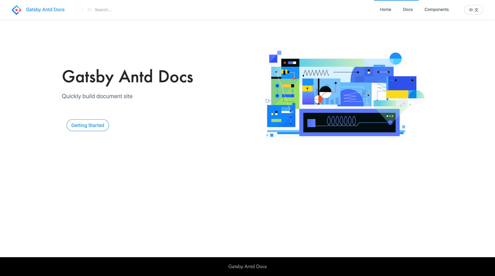

一款 [Gatsby](https://www.gatsbyjs.org/) 主题，方便快速搭建像 [Ant Design](https://ant.design) 这样的文档网站。

> 开始之前，你得先了解 [Gatsby](https://www.gatsbyjs.org/) 以及 [Gatsby主题](https://www.gatsbyjs.org/docs/themes/) 的使用。

---

### 1. 安装主题

```bash
yarn add gatsby-theme-antd-docs
```

### 2. 在你的 `gatsby-config.js` 中添加主题

```js
module.exports = {
  plugins: ['gatsby-theme-antd-docs']
}
```

### 3. 本地运行

```bash
gatsby develop
```

然后打开浏览器访问 http://127.0.0.1:8000



就这么简单！
