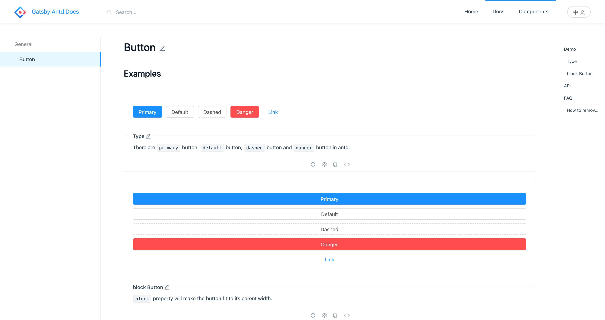

Create file directory like the below tree. Write `jsx` in `.md` of `demo` folder, you can preview it online.

```tree
├── components
    └── button
        ├── index.en-US.md
        ├── index.zh-CN.md
        └── demo
            ├── basic.md
            └── block.md
```

---

### 1. Create file directory like the above tree

### 2. Write `index.en-US.md`

> This file must contain `## API` ，demo will be rendered here.

```markdown
---
category: Components
type: General
title: Button
order: 1
---

## API

...
```

### 3. Write `basic.md` and `block.md`


e.g `basic.md`

```markdown
---
order: 0
title:
  zh-CN: 按钮类型
  en-US: Type
---

## zh-CN

按钮有四种类型：主按钮、次按钮、虚线按钮、危险按钮。主按钮在同一个操作区域最多出现一次。

## en-US

There are `primary` button, `default` button, `dashed` button and `danger` button in antd.

```jsx
import { Button } from 'antd';

ReactDOM.render(
  <div>
    <Button type="primary" style={{ marginRight: 10 }}>Primary</Button>
    <Button style={{ marginRight: 10 }}>Default</Button>
    <Button type="dashed" style={{ marginRight: 10 }}>Dashed</Button>
    <Button type="danger" style={{ marginRight: 10 }}>Danger</Button>
    <Button type="link">Link</Button>
  </div>,
  mountNode
);
```

Open your browser and visit http://127.0.0.1:8000/components/button


