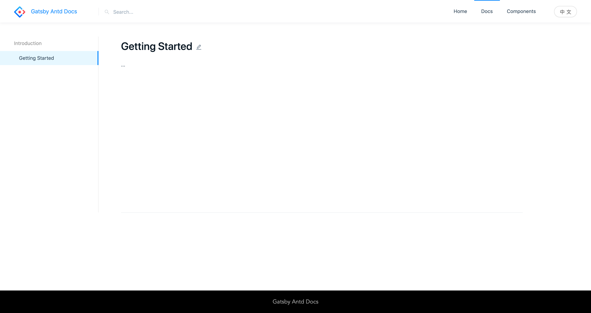

If you understand the markdown syntax, you can write an article.

> Currently supports Chinese and English，`.zh-CN.md`、`.en-US.md`.

---

### 1. Create folder `docs`

Excute the following command at root directory.

```bash
mkdir docs
```

### 2. Create markdown

Excute the following command at `docs`.

```bash
touch getting-started.zh-CN.md
touch getting-started.en-US.md
```

### 3. Write markdown

```markdown
---
order: 1
title: Getting Started
type: Introduction
---

...

```

Open your browser and visit http://127.0.0.1:8000/docs/getting-started


