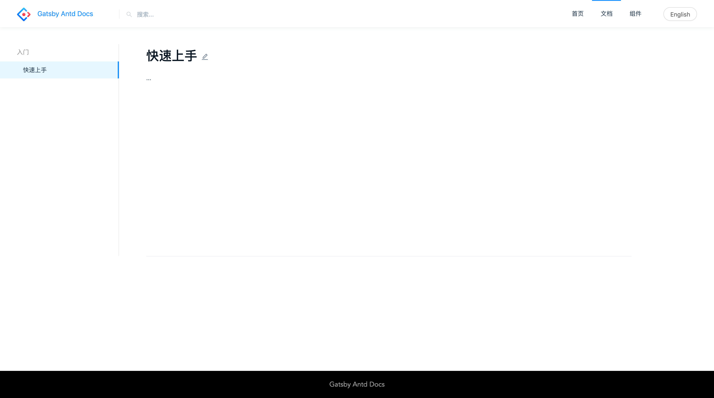

只需要熟悉markdown语法即可熟练写文章。

> 目前支持中文、英文两种语言，`.zh-CN.md`、`.en-US.md` 分别对应中文、英文

---

### 1. 新建docs文件夹

在项目根目录执行

```bash
mkdir docs
```

### 2. 新建markdown

在 `docs` 文件夹执行

```bash
touch getting-started.zh-CN.md
touch getting-started.en-US.md
```

### 3. 编写markdown

```markdown
---
order: 1
title: 快速上手
type: 入门
---

...

```

然后打开浏览器访问 http://127.0.0.1:8000/docs/getting-started-cn


